# 강의 5·6번 차트 해설 — 패스트푸드 영양 데이터

강의자료 **5_StatandVisualization.pptx** 의 모든 차트 유형과
**6_DataDistribution.pptx** 의 모든 분포를, **하나의 데이터**로 그렸습니다.
데이터를 통일해야 차트끼리 비교가 의미 있기 때문입니다.

> 데이터: `../00_doc/01_Fast foods - Nutritional information.xlsx`
> **126개 메뉴 × 8개 변수, 12개 레스토랑, 6개 음식 종류, 결측치 0**

실행 (레포 루트에서): `uv run python hw1/00_lecture_charts/main.py` → `figures/` 에 21개 PNG 생성

각 그림마다 아래 4가지를 답합니다:

| 항목 | 의미 |
|---|---|
| 🎯 **왜 이 차트인가** | 어떤 슬라이드 개념이고, 왜 다른 차트가 아닌 이것인가 |
| 🧭 **목적** | 이 그림으로 하려는 일 |
| 💡 **무엇을 설명하는가** | 이 데이터에서 실제로 읽어낸 결론 |
| 🔍 **어떻게 읽는가** | 그 결론이 **그림의 어느 부분**에서 나오는가 (읽는 법) |

### 기준 숫자

| 변수 | 평균 | 표준편차 | 중앙값 | 왜도(skew) |
|---|---|---|---|---|
| calories | 532.49 | 250.84 | 515 | 0.65 |
| sodium | 973.75 | 523.41 | 930 | 0.42 |
| sugars | 13.29 | 21.02 | 7 | **2.71** |
| serving_size | 224.27 | 108.03 | 217.50 | 0.24 |

**왜도(skew)가 전체를 관통하는 열쇠입니다.** calories는 살짝 오른쪽으로 치우쳤고,
sugars는 극단적으로 치우쳤습니다. 이 한 가지 사실이 *어떤 차트가 정직한지*,
*어떤 분포가 맞는지*를 결정합니다.

---
---

# 📊 강의 5 — 기초 통계와 시각화

---

## 1. 분위수 곡선 (Quantile curve)

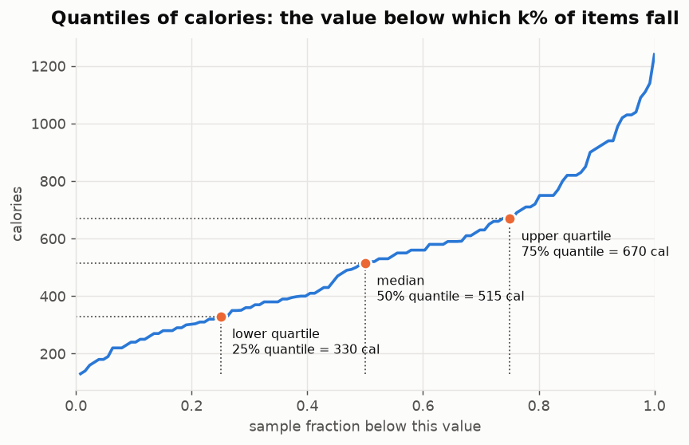

🎯 **왜 이 차트인가**
슬라이드 3~8이 분위수를 *"전체의 k%가 그 아래에 놓이는 값"* 으로 정의합니다.
정렬된 값(세로)을 표본 비율(가로)에 대해 그리면 **그 정의가 그림 그대로**가 됩니다.
공식이 아니라 그림에서 직접 읽습니다.

🧭 **목적**
사분위수가 외워야 할 공식이 아니라 **데이터 위의 절단점**임을 보여주기.

💡 **무엇을 설명하는가**
Q1 = 330, 중앙값 = 515, Q3 = 670 kcal.
메뉴의 **절반이 330~670이라는 좁은 구간**에 몰려 있고, 소수가 1240까지 치솟습니다.

🔍 **어떻게 읽는가**
가로축에서 0.25를 찾아 위로 올라가 곡선을 만난 뒤 왼쪽으로 꺾으면 330이 나옵니다 — 그게 Q1입니다.
핵심은 **곡선의 기울기**입니다.
- 가운데(0.25~0.75)가 **완만** → 그 구간 값들이 서로 비슷함 (조밀)
- 0.8 이후가 **가파름** → 몇 개 안 되는 항목이 값을 급격히 끌어올림

이 가파른 오른쪽 끝이 바로 **왜도(skew)** 입니다. 통계값을 계산하기 *전에* 눈으로 본 것입니다.

---

## 2. 히스토그램 — 구간(bin) 개수 3가지

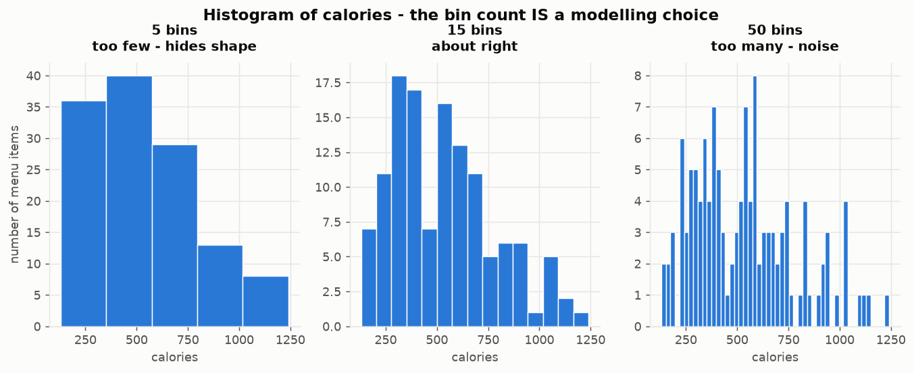

🎯 **왜 이 차트인가**
슬라이드 12는 히스토그램을 *"확률함수의 경험적 표현"* 이라 하면서
**"구간을 어떻게 나눌 것인가?"** 를 되묻습니다. 그 질문에 답하는 그림입니다.

🧭 **목적**
bin 개수가 기본값이 아니라 **분석자의 선택이며 결과를 바꾼다**는 것을 보이기.

💡 **무엇을 설명하는가**
**같은 데이터가 세 가지 다른 이야기를 합니다.** 분석자가 그중 하나를 고르는 것입니다.

🔍 **어떻게 읽는가**
세 패널을 **가로로 비교**하세요. 데이터는 126개로 완전히 동일합니다.
- **5개 bin** — 막대가 너무 굵어 형태가 뭉개짐. 봉우리가 안 보임 (*과소평활*)
- **15개 bin** — 300~600의 넓은 봉우리와 오른쪽 긴 꼬리가 드러남 (적절)
- **50개 bin** — 막대 하나에 1~3개 항목뿐. 들쭉날쭉한 건 **구조가 아니라 잡음** (*과대평활*)

판단 기준: **막대 하나가 여러 항목을 담되, 이웃 막대와 뚜렷이 다를 만큼은 좁게.**

---

## 3. 소형 다중 패널 (Small multiples)

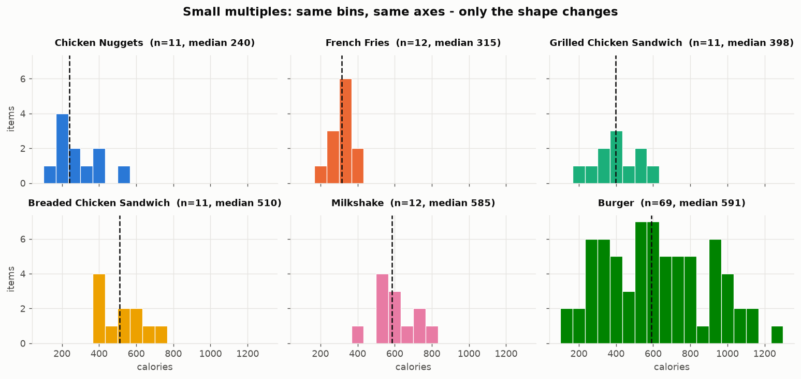

🎯 **왜 이 차트인가**
슬라이드 13 "Clustering Histograms Visually" (Reddit 순위). 그룹마다 히스토그램 하나씩,
**bin과 축을 완전히 동일하게** 맞춥니다. 그래야 패널끼리 직접 비교되고, 서로 가리지 않습니다.

🧭 **목적**
6개 분포를 한 번에 보기. 4번 차트(2개까지가 한계)와 5번 차트(요약으로 뭉개버림)의 **중간 해법**.

💡 **무엇을 설명하는가**
Fries는 뾰족한 단일 막대, Nuggets는 낮은 쪽에 뭉침, Milkshake는 중상단,
**Burger는 모든 구간에 걸쳐 퍼져 있음**.

🔍 **어떻게 읽는가**
**공유 축이 모든 일을 합니다.** 축이 같으니 패널 간 *가로 위치*와 *퍼진 폭*을 바로 비교할 수 있습니다.
- 봉우리의 **가로 위치** = 그 그룹의 전형적인 값
- 분포의 **좌우 폭** = 그 그룹 내부의 편차
- 점선 = 중앙값

각 제목의 `n=` 을 꼭 보세요. 11~12개짜리 그룹은 표본이 작다는 뜻이고,
**뒤에 나올 12번 차트가 이 그룹들의 중앙값을 신뢰하지 못하는 이유**가 여기 있습니다.

---

## 4. 밀도 곡선 (Density line)

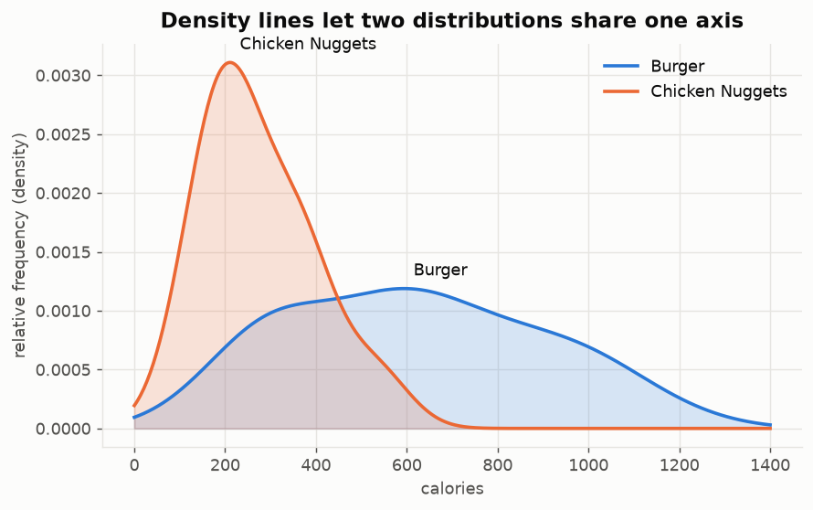

🎯 **왜 이 차트인가**
슬라이드 14: bin을 충분히 늘리면 외곽선이 **확률밀도함수(PDF)** 에 가까워집니다.
막대는 서로 가리지만 **매끄러운 곡선은 겹쳐 그릴 수 있습니다**.

🧭 **목적**
두 분포를 **한 축 위에서** 직접 비교하기.

💡 **무엇을 설명하는가**
Chicken Nuggets는 좁고 높음(봉우리 ≈ 210 kcal), Burger는 낮고 넓어 1000을 넘어감.
차이는 평균만이 아니라 **폭**입니다.

🔍 **어떻게 읽는가**
곡선 아래 면적이 각각 1이므로, **좁으면 반드시 높아집니다.**
- **높고 뾰족** = 값이 한곳에 몰림 → 예측 가능
- **낮고 넓음** = 값이 흩어짐 → 예측 어려움

두 곡선이 교차하는 지점(약 450 kcal)이 두 그룹이 뒤바뀌는 경계입니다.
곡선 **2개가 한계**입니다. 3개부터는 서로 가려서, 그래서 다음 차트가 필요합니다.

---

## 5. 오차 막대 (Error bar)

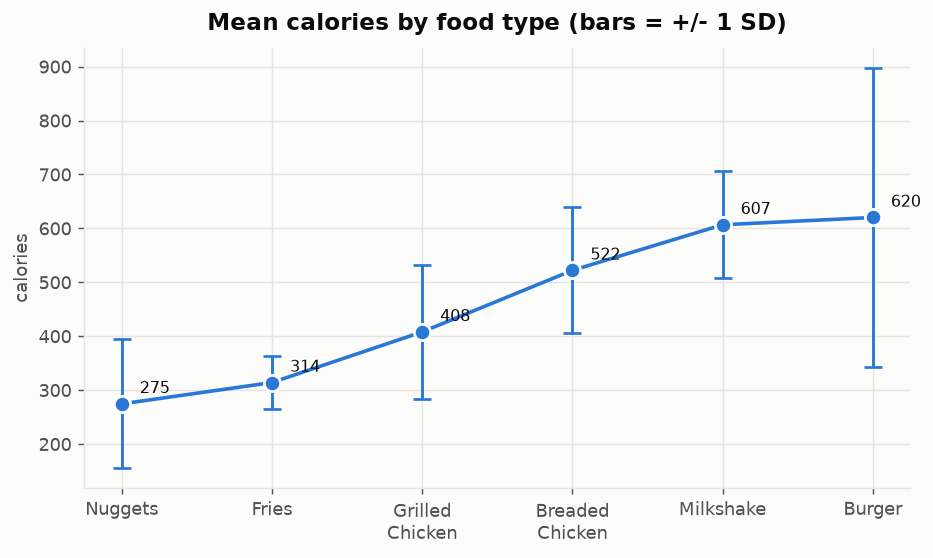

🎯 **왜 이 차트인가**
슬라이드 15: 겹쳐 그리기엔 범주가 너무 많을 때, 각 분포의 **요약을 나란히** 놓습니다.
평균은 선으로, 표준편차는 막대로.

🧭 **목적**
6개 음식 종류를 중심값으로 **순위 매기되**, 퍼짐 정보를 잃지 않기.

💡 **무엇을 설명하는가**
평균은 275 → 620 kcal로 상승합니다. 그런데 **선보다 막대가 더 중요합니다.**
Burger(SD 277)와 Milkshake(SD 99)는 평균이 거의 같지만,
밀크셰이크는 **믿을 만하게** 600 kcal인 반면 버거는 140~1240 사이의 도박입니다.

🔍 **어떻게 읽는가**
두 가지를 **분리해서** 보세요.
- **점의 높이** = 평균 (그룹 간 비교)
- **막대의 길이** = 표준편차 (그룹 **내부**의 변동)

Milkshake와 Burger의 점 높이는 비슷한데 막대 길이는 3배 가까이 차이 납니다.
**평균만으로 순위를 매겼다면 이 사실이 완전히 가려졌을 것입니다.**

---

## 6. 오차 표현의 두 변형 (Error cloud / Bar + error bar)

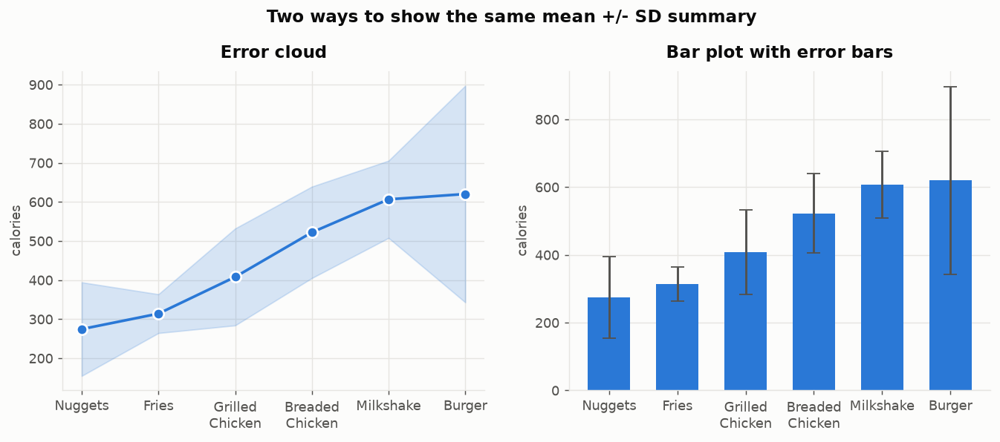

🎯 **왜 이 차트인가**
슬라이드 16이 두 가지 변형을 제시합니다 — 오차 구름(error cloud)과 오차막대 막대그래프.

🧭 **목적**
**숫자는 완전히 동일**하고 **읽히는 방식만 다르다**는 것을 보이기.

💡 **무엇을 설명하는가**
구름은 **추세**를 강조하고, 막대는 **범주별 크기**를 강조하며 0 기준선을 강제합니다.

🔍 **어떻게 읽는가**
같은 데이터인데 눈이 다른 것을 먼저 봅니다.
- **왼쪽(구름)** — 눈이 선을 따라 흐름 → "순서대로 올라간다"
- **오른쪽(막대)** — 눈이 막대 높이를 비교 → "버거가 너겟의 2배"

**선택 기준:** 축에 **순서가 있으면**(시간, 단계, 등급) 구름.
범주가 **서로 독립**이면 막대. 여기 음식 종류는 사실 순서가 없으므로 막대가 더 정직합니다.

---

## 7. 바이올린 플롯 (Violin plot)

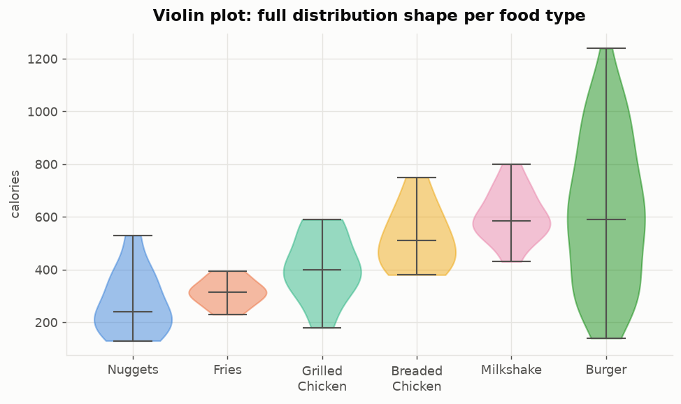

🎯 **왜 이 차트인가**
슬라이드 17. 평균 ± 표준편차는 분포를 **숫자 2개로 압축**해버립니다.
바이올린은 **형태 전체를 보존**합니다.

🧭 **목적**
5번 차트(오차 막대)가 버린 정보를 되살리기.

💡 **무엇을 설명하는가**
6개가 서로 **질적으로 다른 물건**입니다. Burger는 140~1240으로 **축 전체**에 걸침.
Fries는 230~395의 좁은 덩어리. **Milkshake와 Burger는 중앙값이 거의 같은데
(585 vs 591) 형태가 완전히 다릅니다** — 오차 막대는 이것을 말해줄 수 없었습니다.

🔍 **어떻게 읽는가**
**폭 = 그 높이에 항목이 몇 개 있는가** (가로로 부푼 곳에 데이터가 몰려 있음).
- 가운데가 불룩 = 전형적인 단봉 분포
- 위아래로 길쭉 = 편차가 큼
- 가로선 = 중앙값

Burger의 세로 길이가 다른 모든 것을 합친 것만큼 깁니다.
"평균 620 ± 277"이라는 요약이 **얼마나 많은 걸 숨겼는지** 여기서 드러납니다.

---

## 8. 결합 바이올린 (Combined violin)

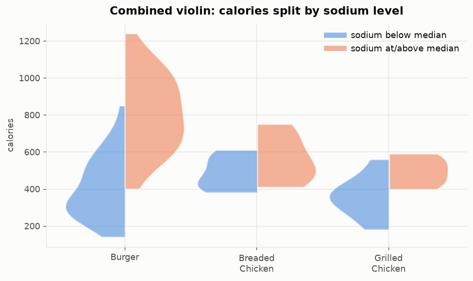

🎯 **왜 이 차트인가**
슬라이드 18: 바이올린을 좌우로 쪼개, **같은 범주 안에서** 두 번째 변수를 비교합니다.

🧭 **목적**
"나트륨이 높으면 칼로리도 높은가?"를 **음식 종류를 통제한 상태**에서 묻기.

💡 **무엇을 설명하는가**
세 가지 샌드위치 **모두에서** 고나트륨 쪽(주황)이 칼로리도 뚜렷이 높습니다.
이 관계는 **범주 내부에서도 유지**되므로, 버거와 너겟을 비교해서 생긴 착시가 아닙니다.

🔍 **어떻게 읽는가**
**같은 눈금 위에서 왼쪽 반과 오른쪽 반의 높이를 비교**하세요.
- 파랑(왼쪽) = 나트륨 중앙값 미만
- 주황(오른쪽) = 나트륨 중앙값 이상

이 구조가 중요한 이유: 만약 전체 데이터에서만 비교했다면
"버거가 나트륨도 칼로리도 높다"는 **음식 종류 때문일 뿐**일 수 있습니다.
종류를 고정하고도 차이가 남는다는 것이 **훨씬 강한 증거**입니다.

---

## 9. 바코드 차트 (Barcode chart)

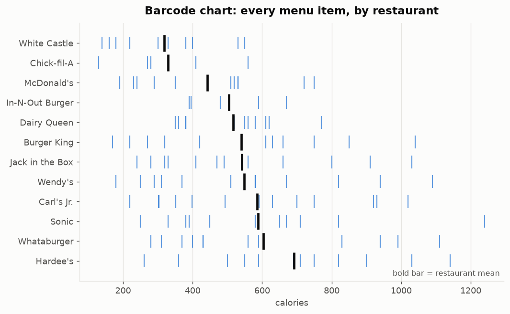

🎯 **왜 이 차트인가**
슬라이드 19가 **"언제 유용한가?"** 를 직접 묻고 3가지 조건을 답으로 줍니다.
**여기서 세 조건이 모두 성립합니다:**
1. 단위 호환 — 모든 행이 칼로리
2. 데이터 점이 적음 — 레스토랑당 5~13개
3. 공간을 거의 안 씀 — 12개 행이 한 화면에

그래서 이 차트가 여기서 **정당합니다.**

🧭 **목적**
요약이 아니라 **개별 항목 전부**를 보여주기 (굵은 막대 = 해당 레스토랑 평균).

💡 **무엇을 설명하는가**
Hardee's 평균 692로 최고, White Castle 319로 최저.
그런데 두 메뉴는 **260~550 구간에서 겹칩니다.**
Hardee's의 가장 가벼운 항목(260)이 White Castle의 여러 항목보다 가볍습니다.
→ **"Hardee's가 칼로리 높은 집"이라는 말은 항목 단위로는 참이 아닙니다.**
단, White Castle의 최고값(550)도 Hardee's 평균(692)에는 못 미칩니다. 순위 자체는 유효합니다.

🔍 **어떻게 읽는가**
가는 막대 하나하나가 **실제 메뉴 1개**입니다.
- 행 **전체의 가로 범위** = 그 레스토랑 메뉴의 폭
- **굵은 막대** = 평균
- 행끼리 **가로로 겹치는 구간** = 두 레스토랑이 구분되지 않는 영역

핵심 기법: **평균끼리의 거리**와 **분포끼리의 겹침**을 동시에 봅니다.
평균 막대그래프였다면 겹침이 아예 보이지 않았을 것입니다.

---

## 10. 상자그림 해부 (Box plot anatomy)

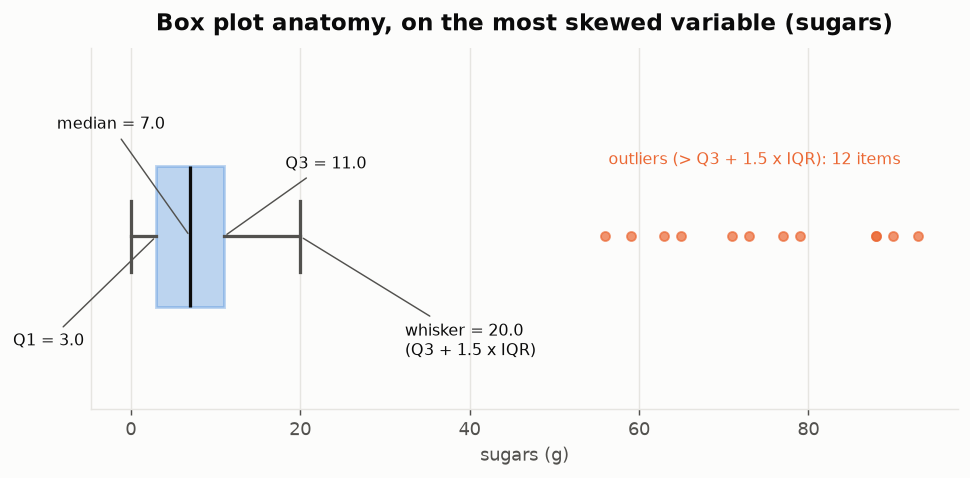

🎯 **왜 이 차트인가**
슬라이드 20이 작도법을 정확히 정의합니다:
상자 = Q1~Q3, 수염 = **1.5 × IQR 안쪽의 가장 먼 값**, 그 바깥 = 이상치.

🧭 **목적**
데이터에서 **가장 치우친 변수(sugars)** 위에 각 부위를 라벨링하기.

💡 **무엇을 설명하는가**
Q1 = 3, 중앙값 = 7, Q3 = 11, 수염 = 20, **이상치 12개**가 93 g까지.
상자가 축 맨 왼쪽의 얇은 조각에 불과합니다 — **극단적 오른쪽 왜도의 초상화**이며,
**평균(13.29)이 Q3(11)보다 큰데 중앙값은 7인 이유**입니다.

🔍 **어떻게 읽는가**
계산 순서를 따라가 보세요:
1. IQR = Q3 − Q1 = 11 − 3 = **8**
2. 울타리 = Q3 + 1.5 × 8 = **23**
3. 수염은 23 이하 중 **실제로 존재하는** 가장 큰 값 → **20**
4. 20을 넘는 12개 항목 = **이상치**

**"평균이 Q3보다 크다"** 는 것이 왜도의 결정적 신호입니다.
데이터의 75%가 11 이하인데 평균이 13.29라면, 소수의 거대한 값이 평균을 끌어올린 것입니다.
→ **이런 변수는 평균이 아니라 중앙값으로 요약해야 합니다.**

---

## 11. 상자그림 나란히 비교

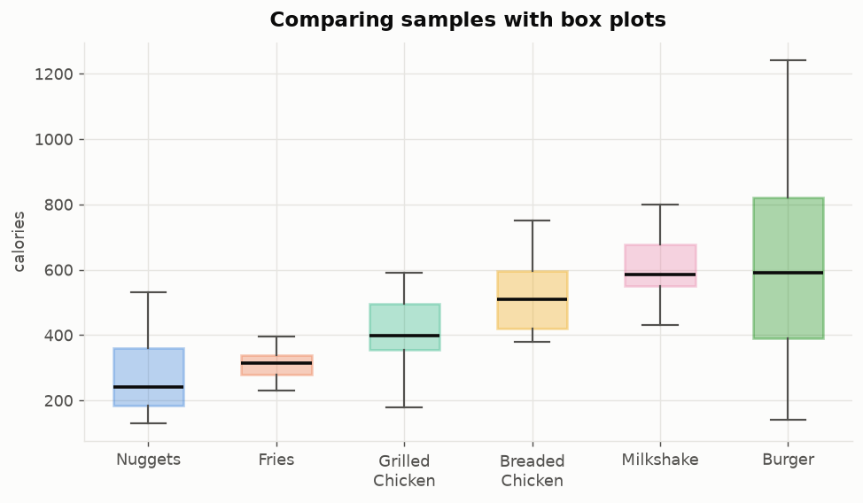

🎯 **왜 이 차트인가**
슬라이드 21 — 여러 표본의 **중심과 퍼짐을 동시에** 비교.

🧭 **목적**
6개 분포를 한 화면에 압축해 넣기.

💡 **무엇을 설명하는가**
중앙값이 240 → 591로 상승. Milkshake와 Burger는 **중앙값이 거의 같은데 상자 높이가
크게 다릅니다** — 5번 차트와 같은 "중심 vs 퍼짐" 논점이, 이번엔 이상치까지 개별로 보입니다.

🔍 **어떻게 읽는가**
바이올린보다 **정보는 적지만 정확한 숫자를 읽기 쉽습니다.**
- **상자 높이** = IQR = 가운데 50%가 차지하는 폭
- **상자 안 굵은 선** = 중앙값
- **점** = 이상치 (개별 항목)

읽는 순서: ① 중앙값 선끼리 비교 → ② 상자 높이 비교 → ③ 이상치 확인.
⚠️ **여기서 "달라 보인다"는 아직 통계적 주장이 아닙니다.** 그래서 다음 차트가 필요합니다.

---

## 12. 노치 상자그림 (Notched box plot)

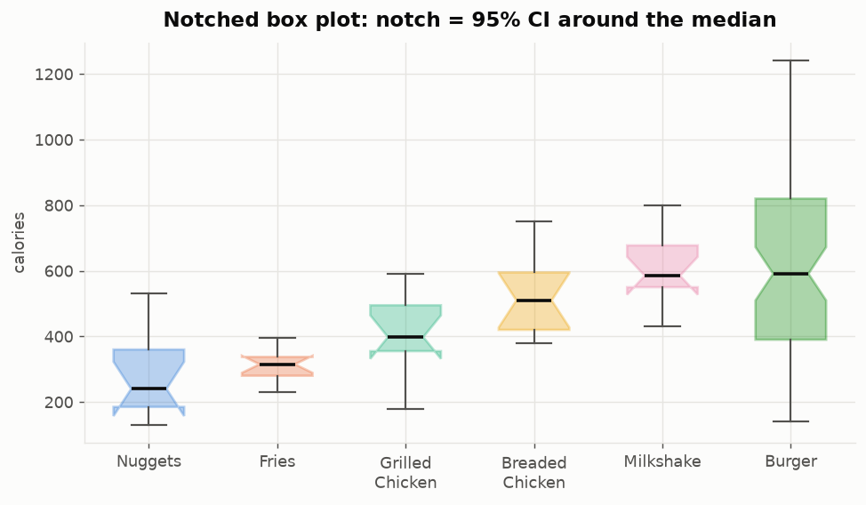

🎯 **왜 이 차트인가**
슬라이드 22. 노치(잘록한 부분)는 **중앙값에 대한 약 95% 신뢰구간**입니다.

🧭 **목적**
"달라 보인다"를 **"통계적으로 다르다"** 로 격상시키기.

💡 **무엇을 설명하는가**
Nuggets/Fries의 노치는 Milkshake/Burger보다 훨씬 아래 → **실제 차이**.
그러나 **Milkshake [527, 643] 와 Burger [510, 672] 는 겹칩니다.**
→ 두 중앙값은 이 표본 크기에서 **구별되지 않습니다.**
11번 차트(민무늬 상자그림)는 정반대 결론으로 이끌 뻔했습니다.

🔍 **어떻게 읽는가**
**노치의 세로 구간이 겹치는지만** 보면 됩니다.
- **안 겹침** → 중앙값이 다르다고 말할 수 있음
- **겹침** → 차이가 있다고 주장할 근거 없음

**뒤집힌 노치를 읽으세요.** Nuggets와 Fries는 노치가 상자 밖으로 삐져나옵니다.
이건 **버그가 아닙니다.** 중앙값의 신뢰구간이 IQR보다 넓다는 뜻,
즉 **표본이 너무 작아 중앙값을 특정할 수 없다**는 경고입니다 (각 11개, 12개).
matplotlib이 숨기지 않고 그대로 그려주는 것이며, 반드시 읽어야 할 신호입니다.

---

## 13. 부트스트랩 신뢰구간 (Bootstrap CI)

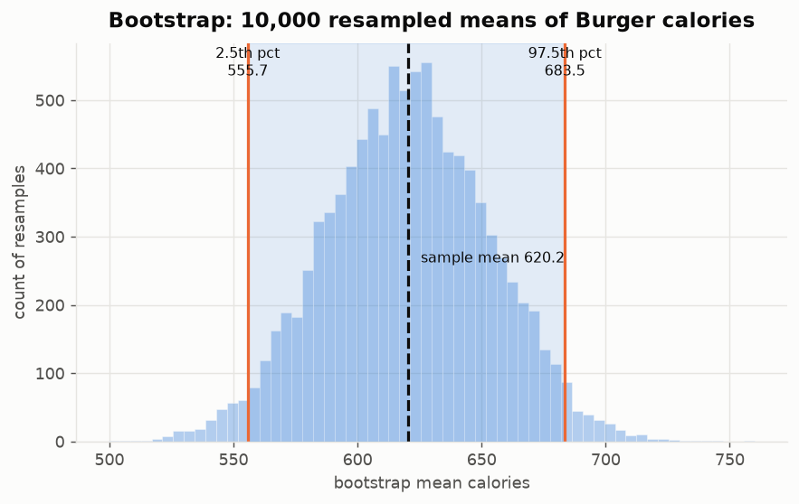

🎯 **왜 이 차트인가**
슬라이드 25~26: **복원추출로 10,000번 재표집**한 뒤, 평균들의 가운데 95%를 취합니다.
**정규성 가정이 필요 없습니다** — 이 데이터가 치우쳐 있으므로 이 점이 결정적입니다.

🧭 **목적**
평균 하나에 담긴 **불확실성**을 수치화하기.

💡 **무엇을 설명하는가**
Burger 평균 = 620.2, **95% CI [557.1, 686.4]**.
개별 버거의 퍼짐은 ±277인데, **평균의** 퍼짐은 ±65에 불과합니다.

🔍 **어떻게 읽는가**
**히스토그램의 정체를 혼동하지 마세요.** 이건 버거들의 분포가 아니라
**"평균"이라는 값 10,000개의 분포**입니다.

절차:
1. 69개 버거에서 **복원추출**로 69개를 뽑음 (중복 허용)
2. 그 평균을 기록
3. 10,000번 반복
4. 2.5번째 백분위수 ~ 97.5번째 백분위수 = **95% CI**

**왜 평균의 퍼짐이 더 좁은가?** 평균을 낼 때 높은 값과 낮은 값이 서로 상쇄되기 때문입니다.
**"개별 항목의 퍼짐(±277)"과 "평균의 퍼짐(±65)"은 완전히 다른 양**이며,
강의자료가 이 둘을 의도적으로 구분합니다.

---

## 14. 두 신뢰구간 비교

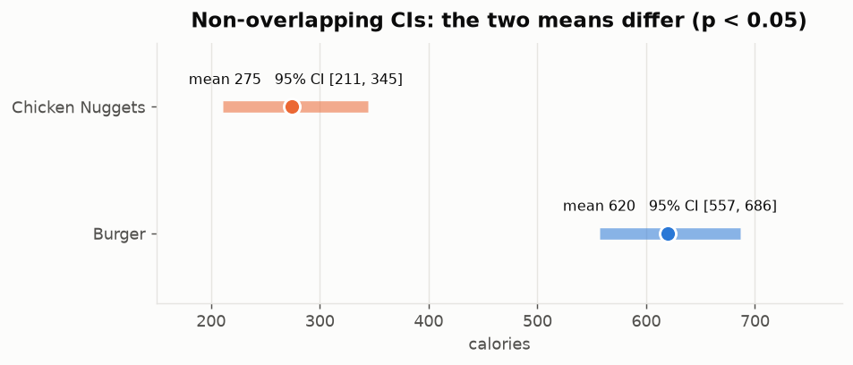

🎯 **왜 이 차트인가**
슬라이드 27: **신뢰구간이 겹치지 않으면 통계적으로 다르다 (p < 0.05).**

🧭 **목적**
두 구간을 하나의 **판단**으로 바꾸기.

💡 **무엇을 설명하는가**
Burger [557, 686] vs Chicken Nuggets [211, 345] — **200 kcal 넘는 간격, 겹침 없음.**
→ 차이는 **실재**하며 표집 잡음이 아닙니다.

🔍 **어떻게 읽는가**
가로 막대 두 개가 **가로축 상에서 겹치는지**만 확인합니다.
- 점 = 표본 평균
- 막대 = 95% CI

여기서는 686 < 시작점이 아니라, 345 < 557 이므로 **완전히 분리**되어 있습니다.
⚠️ **주의:** "겹치지 않음 → 다름"은 성립하지만, 그 **역은 성립하지 않습니다.**
겹친다고 해서 같다는 뜻은 아니며, 그때는 정식 검정이 필요합니다.
(12번 차트의 Milkshake/Burger가 바로 그 "판단 보류" 사례입니다.)

---
---

# 📈 강의 6 — 데이터와 분포

## 추정된 파라미터

| 분포 | 변수 | 파라미터 |
|---|---|---|
| 정규 (Normal) | calories | μ = 532.49, σ = 249.85 |
| 지수 (Exponential) | sugars | λ = 1/평균 = 0.0753 (평균 13.29 g) |
| 베르누이 (Bernoulli) | sodium > 1000 mg | p = 0.4524 |
| 이항 (Binomial) | n = 10회 추출 | 평균 = n·p = 4.52, SD = 1.57 |
| 균등 (Uniform) | — | **해당 변수 없음** (이론 참조용 곡선만) |
| 멱법칙 (Power law) | — | **꼬리가 짧아 추정 불가** (이론 참조용 곡선만) |

> *σ = 249.85 인데 위의 표준편차는 250.84인 이유:* `norm.fit`은 최대우도추정(MLE)이라
> **n으로 나누고**, pandas `.std()`는 **n−1로 나눕니다**. 같은 데이터, 다른 관례입니다.

---

## 15. 정규분포 적합 (Normal fit)

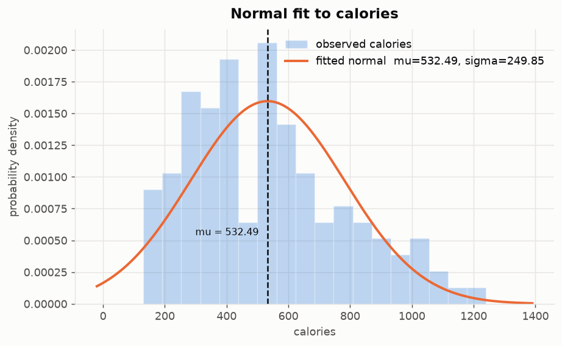

🎯 **왜 이 차트인가**
슬라이드 4~6, 10. 적합된 PDF를 히스토그램 **위에 겹쳐 그리는 것**이
가정이 성립하는지 확인하는 유일한 방법입니다.

🧭 **목적**
μ와 σ를 추정해 보이기 — **정규분포는 곧 이 두 숫자**입니다.

💡 **무엇을 설명하는가**
중심부는 잘 따라갑니다. **양쪽 끝에서 실패합니다:**
0 kcal 미만에 확률을 배정하고(물리적으로 불가능), 1000 이상의 꼬리를 과소평가합니다.
→ **중심은 괜찮고 꼬리는 틀림** — 대칭 곡선을 치우친 데이터에 맞출 때의 전형적 징후입니다.

🔍 **어떻게 읽는가**
**막대와 곡선의 수직 차이**를 구간별로 훑으세요.
- 200~500: 막대가 곡선보다 **높음** → 실제 데이터가 여기 더 몰려 있음
- 0 근처: 곡선이 떠 있는데 막대는 **없음** → 모델이 불가능한 값에 확률 부여
- 1000 이상: 막대가 곡선보다 **높음** → 꼬리를 과소평가

**적합의 좋고 나쁨은 "곡선이 예쁜가"가 아니라 "막대와 얼마나 벌어지는가"로 판단합니다.**

---

## 16. 68–95 규칙 (±1σ, ±2σ)

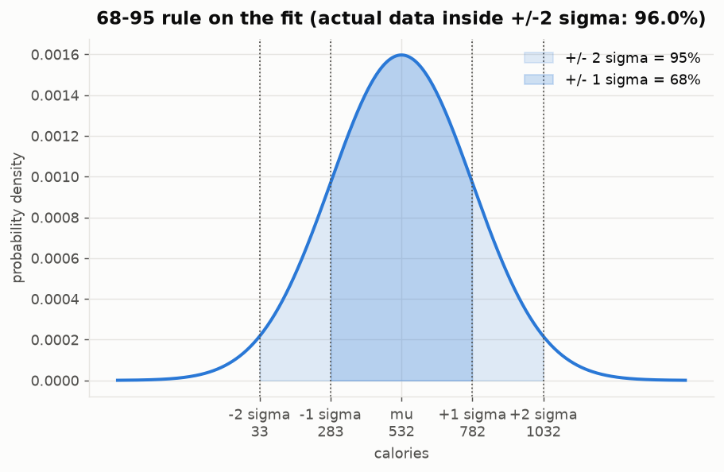

🎯 **왜 이 차트인가**
슬라이드 7: 전체 질량의 95%가 **±2σ 안에** 놓입니다.

🧭 **목적**
그 규칙을 주장하는 대신 **실제 데이터로 검증**하기.

💡 **무엇을 설명하는가**
±2σ는 33 ~ 1032 kcal이고, **실제 항목의 96.0%가 그 안에** 들어옵니다 — 약속된 95%에 근접.
그러나 **하한 33 kcal은 메뉴로서 말이 안 됩니다.**
→ 규칙은 **숫자상으로는 성립**하지만 모델은 **왼쪽 끝에서 물리적으로 틀렸습니다.**

🔍 **어떻게 읽는가**
눈금이 σ 단위로 찍혀 있어 바로 읽힙니다.
- **진한 영역** = ±1σ = 이론상 68%
- **연한 영역까지** = ±2σ = 이론상 95%
- 제목의 96.0% = **실제 데이터**로 센 비율

**이 그림의 교훈:** 96% ≈ 95%라고 "잘 맞는다"고 결론내면 안 됩니다.
**맞는 것처럼 보이는 수치와, 모델이 실제로 타당한지는 별개**입니다.
하한이 음수에 가까운 33이라는 사실이 그 증거입니다.

---

## 17. 경험적 CDF vs 적합 CDF

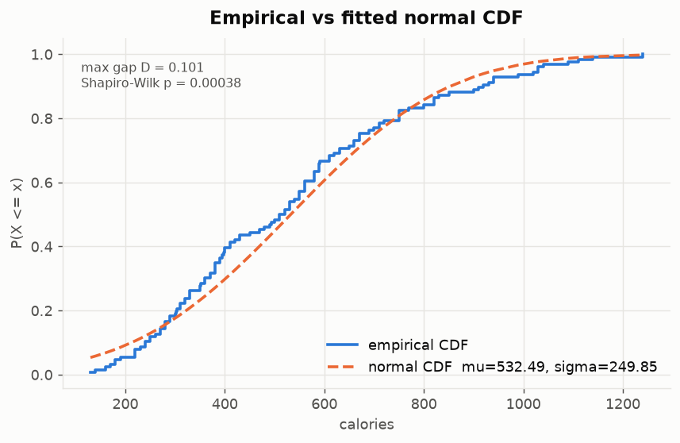

🎯 **왜 이 차트인가**
히스토그램의 판정은 **bin 선택에 좌우**됩니다(2번 차트에서 본 대로).
CDF는 **bin이 없으므로** 비교가 모호하지 않습니다. 불일치가 **수직 간격**으로 보입니다.

🧭 **목적**
bin 폭이라는 교란 요인 없이 정규성 판정하기.

💡 **무엇을 설명하는가**
최대 간격 **D = 0.100**, **Shapiro-Wilk p = 0.00038**
→ **유의수준 0.05에서 정규성 기각.**
calories는 정규분포에 *가깝지만* — 쓸 만할 만큼은 가깝지만 — **정규분포가 아닙니다.**

🔍 **어떻게 읽는가**
두 곡선 사이의 **가장 큰 세로 틈**을 찾으세요. 그게 D입니다.
- 파란 계단 = 실제 데이터 (경험적 CDF)
- 주황 점선 = 적합된 정규분포

400 근처에서 파란 선이 위로 튀어나옵니다 = **그 지점까지 실제 항목이 모델 예측보다 많다**는 뜻.
세로축이 "이 값 이하일 확률"이므로, 위로 튄다 = 낮은 값에 더 몰려 있다 = **오른쪽으로 치우침**.

> *판정을 Shapiro가 맡고 KS의 p값을 쓰지 않은 이유:* μ와 σ를 **같은 표본에서 추정**했기 때문에
> KS의 p값은 실제보다 낙관적으로 나옵니다. D는 "눈에 보이는 간격"의 기술통계로만 씁니다.

---

## 18. 지수분포 적합 (Exponential fit)

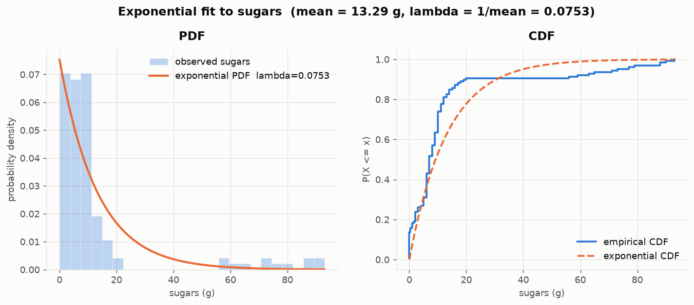

🎯 **왜 이 차트인가**
슬라이드 15~18. 지수분포의 파라미터는 **λ = 1/평균 하나뿐**이고,
sugars가 이 데이터에서 지수 형태를 띠는 변수입니다 (왜도 2.71).

🧭 **목적**
치우친 변수에 **형태가 맞는** 분포를 적용하기.

💡 **무엇을 설명하는가**
λ = 0.0753. PDF는 "대부분 항목이 당분이 적다"는 주된 질량을 잘 잡아냅니다.
**그러나 CDF 패널이 실패를 폭로합니다:** 경험적 곡선이
**20 g에서 55 g까지 평평하다가 갑자기 튀어오릅니다.**
20 g을 넘는 12개 항목은 **전부 밀크셰이크입니다 (12/12 확인).**
→ 이건 **두 개의 모집단**(음료 vs 음식)이며, **어떤 단일 지수분포도 이 간극을 표현할 수 없습니다.**

🔍 **어떻게 읽는가**
**CDF의 평평한 구간이 핵심 단서**입니다.
CDF가 평평하다 = **그 구간에 데이터가 하나도 없다**는 뜻입니다.
- 0~20 g: 가파르게 상승 (항목 대부분이 여기)
- 20~55 g: **완전히 평평** → 이 구간에 메뉴가 없음
- 55 g~: 다시 상승 → 밀크셰이크들

단일 분포는 **연속적**이므로 이런 빈 구간을 만들 수 없습니다.
빈 구간이 보인다 = **데이터가 사실 여러 집단의 혼합**이라는 신호입니다.
> 직접 만드신 `fig3_sugars_bimodal.png` 와 정확히 같은 결론입니다.

---

## 19. 균등분포 (Uniform) — 이론 참조

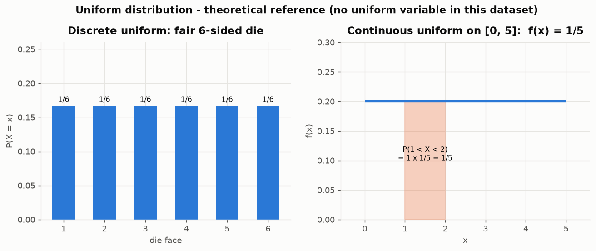

🎯 **왜 이 차트인가**
슬라이드 11~13 — 주사위 PMF와 연속 직사각형.

🧭 **목적**
두 형태와 **확률 계산법**을 함께 보이기.

💡 **무엇을 설명하는가**
주사위는 각 면이 정확히 1/6. 연속 [0,5] 구간에서는 밀도가 1/5이고
P(1 < X < 2) = 1 × 1/5 = 1/5.
**이 데이터에는 균등분포인 변수가 없습니다** — 데이터에 억지로 맞추지 않고
**이론 참조용이라고 명시**해 그렸습니다.

🔍 **어떻게 읽는가**
연속형에서 확률은 **높이가 아니라 넓이**입니다.
- 높이 f(x) = 1/5 (그 자체는 확률이 아님)
- P(1 < X < 2) = **가로 1 × 세로 1/5** = 1/5 ← 색칠된 직사각형의 **면적**
- **P(X = 4) = 0** — 폭이 0이면 면적도 0

> ⚠️ **`p1_figures.py` 와 관련된 주의:** `serving_size`에 균등분포 참조선을 그리셨는데,
> 검증 결과 균등분포와의 CDF 격차(0.153)가 **정규분포와의 격차(0.101)보다 큽니다.**
> 십분위 개수도 `12, 23, 11, 16, 14, 16, 11, 11, 10, 2`로 **마지막 구간이 2개뿐**이라 평평하지 않습니다.
> 왜도 0.24는 *대칭*이라는 뜻이지 *평평*하다는 뜻이 아닙니다.

---

## 20. 멱법칙 vs 지수분포 (Power law vs Exponential)

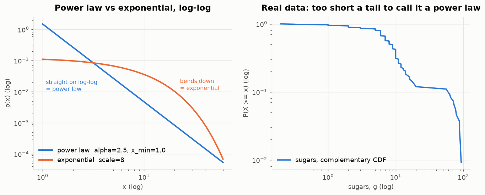

🎯 **왜 이 차트인가**
슬라이드 20~22. **로그-로그 축에서 멱법칙은 직선, 지수분포는 아래로 휩니다.**
이 대비가 판별법의 전부이며, **일반 축에서는 보이지 않습니다.**

🧭 **목적**
판별법을 가르친 뒤 **실제로 적용**해 보기.

💡 **무엇을 설명하는가**
왼쪽: 두 이론 형태 (α = 2.5 vs scale 8).
오른쪽: 실제 sugars 꼬리 — **직선도 아니고 깔끔한 곡선도 아닙니다.**
**126개로는 멱법칙을 판별할 만큼 꼬리가 길지 않습니다.**
→ 정답은 α 추정값이 아니라 **"판단할 수 없다"** 입니다.

🔍 **어떻게 읽는가**
**양축에 로그를 씌운 뒤 직선인지만 봅니다.**
- 멱법칙 $p(x) \propto x^{-\alpha}$ → 로그 취하면 $\log p = -\alpha \log x + C$ → **직선**
- 지수분포 $p(x) \propto e^{-\lambda x}$ → 로그 취해도 x가 그대로 남음 → **아래로 휨**

멱법칙 판별에는 **자릿수(order of magnitude) 몇 단계**의 범위가 필요합니다.
sugars는 대략 **한 자릿수 범위뿐**이라 근거가 부족합니다.
→ 이럴 때 α를 적어내면 **근거 없는 숫자**가 됩니다.

---

## 21. 베르누이 → 이항분포

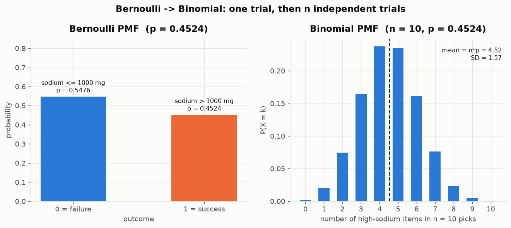

🎯 **왜 이 차트인가**
슬라이드 23~29. 각 항목을 **이진 결과로 변환**한 뒤, n번 독립 시행의 성공 횟수를 셉니다.

🧭 **목적**
둘이 **같은 메커니즘**이며 n = 1과 n = 10의 차이뿐임을 보이기.

💡 **무엇을 설명하는가**
항목의 **p = 0.4524** 가 나트륨 1000 mg을 넘습니다 — 거의 동전 던지기.
10개를 뽑으면 개수는 평균 4.52, SD 1.57에 집중되고,
p ≈ 0.5이므로 PMF가 거의 대칭입니다.
→ **패스트푸드 메뉴의 절반 가까이가 하루 권장 나트륨의 1/3 이상을 담고 있습니다.**

🔍 **어떻게 읽는가**
**연결 고리를 따라가세요.**
- **왼쪽 (베르누이)** = 시행 **1번**. 막대 2개뿐이고 합이 1. 이게 기본 단위입니다.
- **오른쪽 (이항)** = 그 시행을 **10번 독립 반복**했을 때 성공 **횟수**의 분포

가로축의 의미가 완전히 다릅니다: 왼쪽은 **결과**(0 또는 1), 오른쪽은 **횟수**(0~10개).
- 평균 = n·p = 10 × 0.4524 = **4.52**
- SD = √(n·p·(1−p)) = **1.57**
- p가 0.5에 가까울수록 **좌우 대칭**, 0이나 1에 가까울수록 한쪽으로 치우침

---
---

# 🧩 전체 요약 — 21개 차트가 말하는 것

**1. 요약통계는 형태를 숨깁니다.**
평균 ± SD로는 Burger와 Milkshake가 비슷해 보였습니다 (620 ± 277 vs 607 ± 99, 중앙값 591 vs 585).
바이올린은 하나가 축 전체에 퍼져 있고 다른 하나는 촘촘히 뭉쳐 있음을 보여줬습니다.
**중심은 같고 물건은 다릅니다.**

**2. 왜도가 도구를 결정합니다.**
calories(왜도 0.65)는 정규분포 적합을 견딥니다.
sugars(왜도 2.71)는 지수분포가 필요하며, **평균이 Q3를 넘어선 순간 평균은 요약값으로서 자격을 잃습니다.**

**3. 진짜 질문은 "겹치는가"입니다.**
평균은 Hardee's를 White Castle 위에 놓았지만, 바코드 차트는 두 메뉴가 거의 완전히 겹침을 보여줬습니다.
**노치 상자그림과 부트스트랩 CI가 "실재하는 차이"와 "그냥 달라 보이는 것"을 갈라놓습니다.**

**4. 모든 데이터에 모든 분포가 있는 것은 아닙니다.**
균등분포와 멱법칙은 여기서 **이론으로 표시해** 그렸습니다.
126개짜리 꼬리에 α 추정값을 적어내는 것은 **근거 없는 숫자를 만드는 일**이었을 것입니다.

---

*영문판 원본: `x_README.en.md`*
